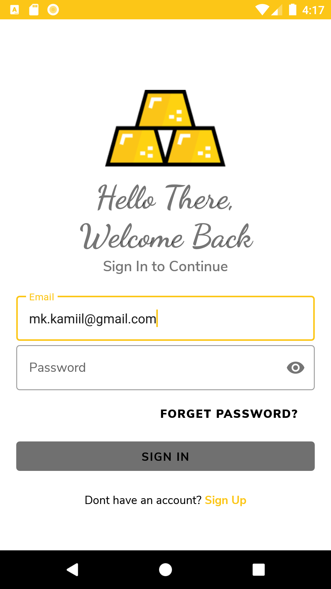
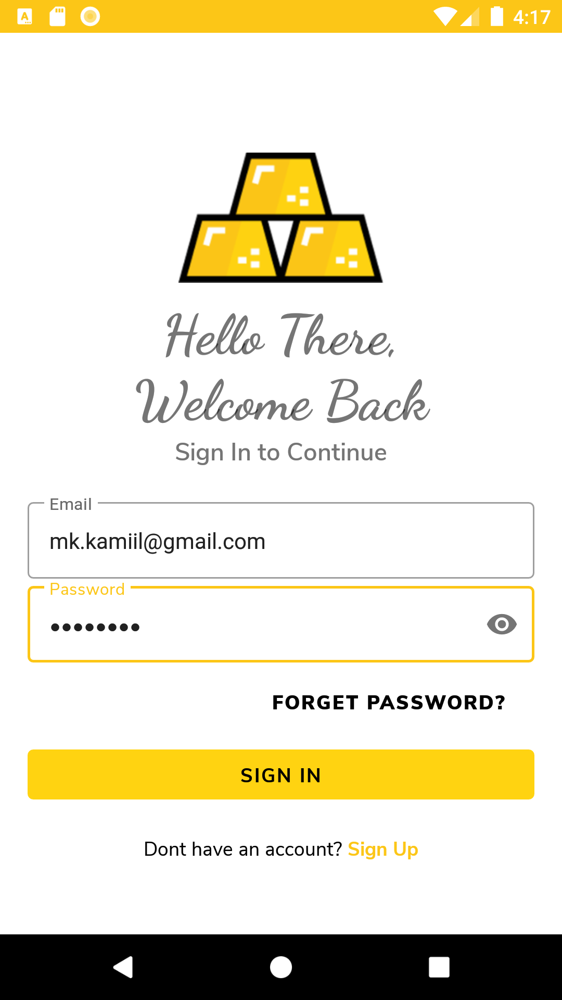
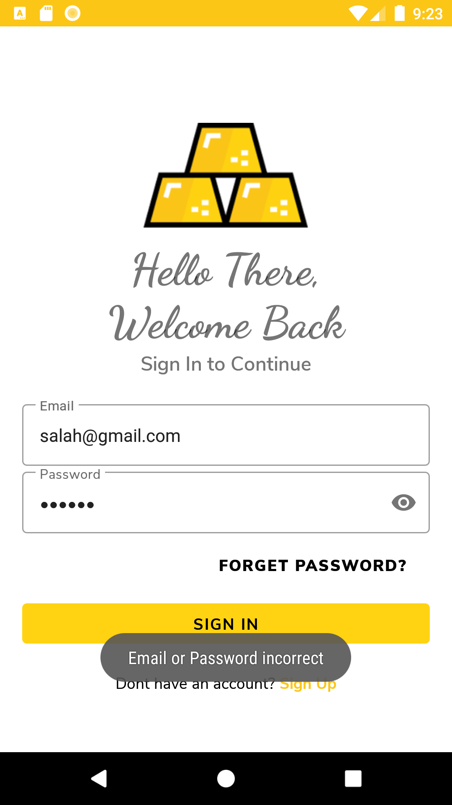
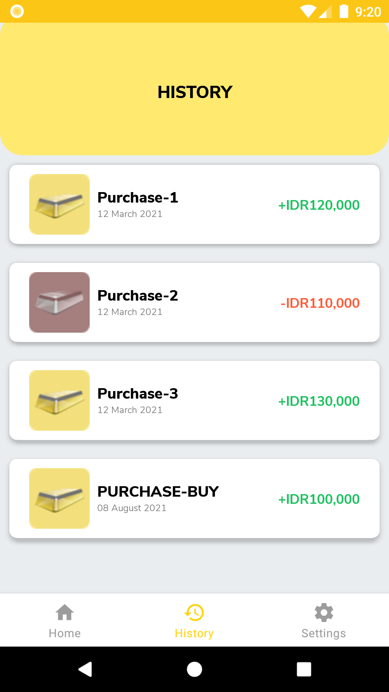
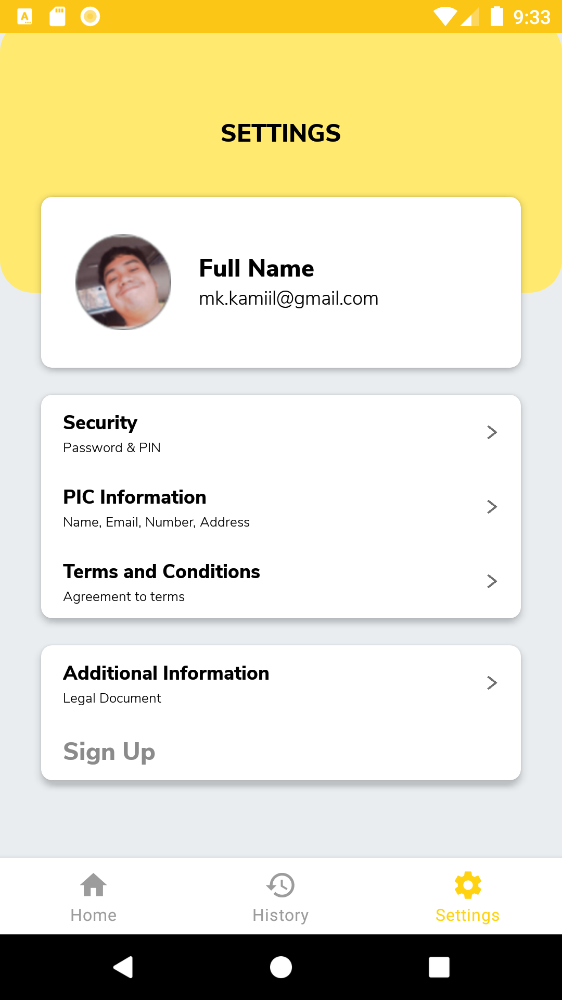
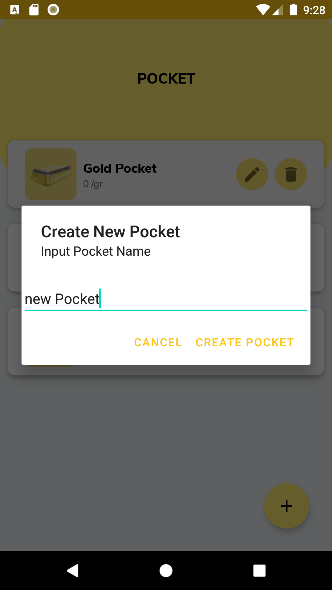
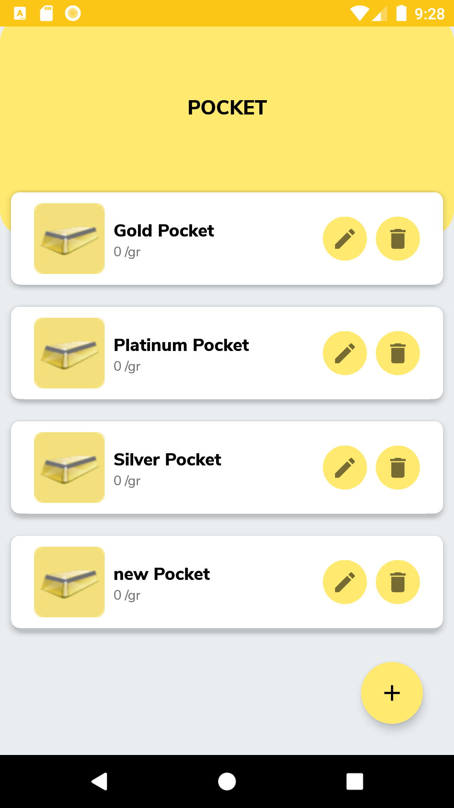

# Gold Market (Android Kotlin Project)

## How to Use
* Download Jar Backend in <a href="https://git.enigmacamp.com/enigma-camp/class-mandiri/muhammad-kamil/kotlin/challenge/challenge-android/-/blob/retrofit/backend/gold-pocket-boot-0.0.1-SNAPSHOT.jar">Backend Gold Pocket</a>
* Run Jar file with command ``java -jar gold-pocket-boot-0.0.1-SNAPSHOT.jar``
* Run Project
* REGISTER FIRST TO LOGIN

## Screenshot

    
    
    
    
    
    
    
    
    
    
    
    

